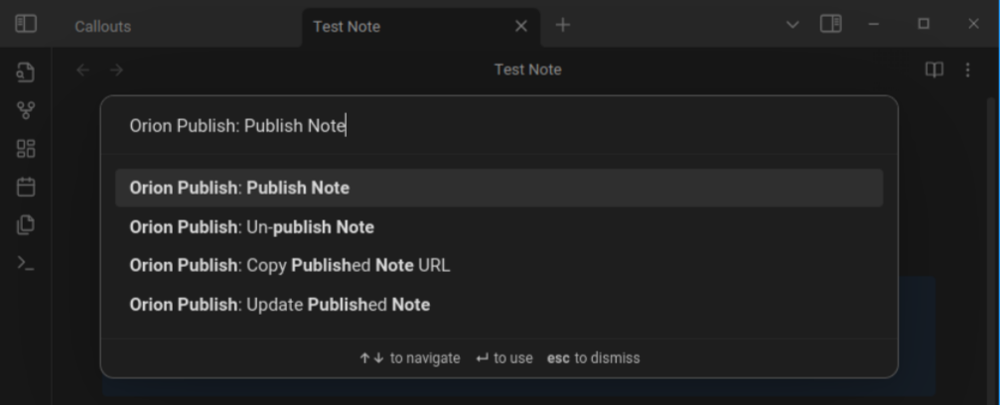
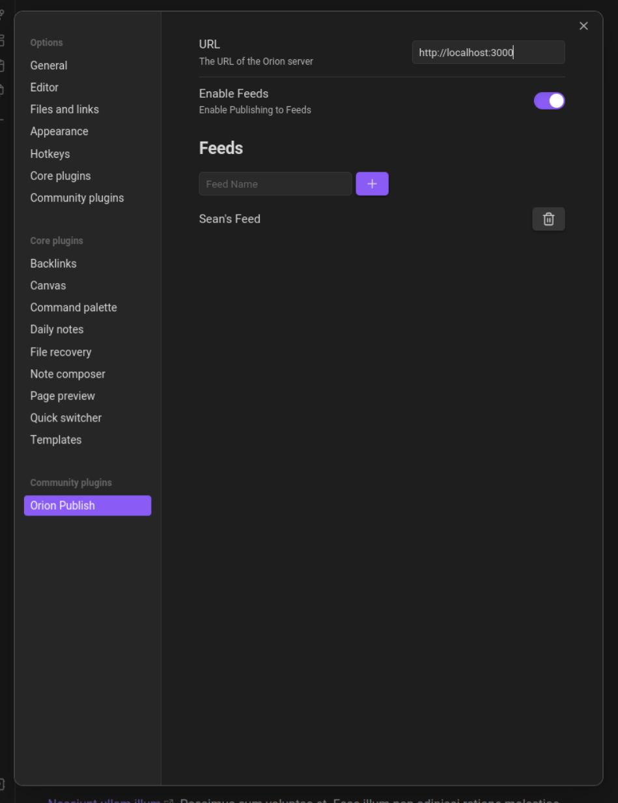

## Orion Publish Obsiain Plugin

Orion Publish is a plugin for [Obsidian](https://obsidian.md) that allows you to easly publish notes on the web & share them with others.

The site is hosted at [orion.seancollings.dev](https://orion.seancollings.dev). The source code for the site is available [here](https://github.com/seanrcollings/orion-publish-site). You are free to host your own version of it if you wish (or implement your own version entirely, as long as it follows the same URL patterns!).

## Instructions
All of Orion's functionality is available in the command palette.

- `Orion Publish: Publish Note` - Publishes the current note to the web.
- `Orion Publish: Update Published Note` - Updates the current note on the web.
- `Orion Publish: Unpublish Note` - Removes the current note from the web.
- `Orion Publish: Copy Published Note URL` - Copies the current note's URL to the clipboard.

### Settings

### Custom Domain
You can point the plugin to a custom domain in the settings menu. This will change the URL that your notes are published to.

#### Feeds
Orion Publish supports feeds to collect multiple notes into a single group. You can create a feed in the settings menu.

After you create a feed, each time you publish a note you can select which feed to add it to. You also have the option to publish a note without adding it to a feed.

**Note**: When you delete a feed, the notes in that feed will not be deleted from the web. You will need to manually unpublish each of them.
